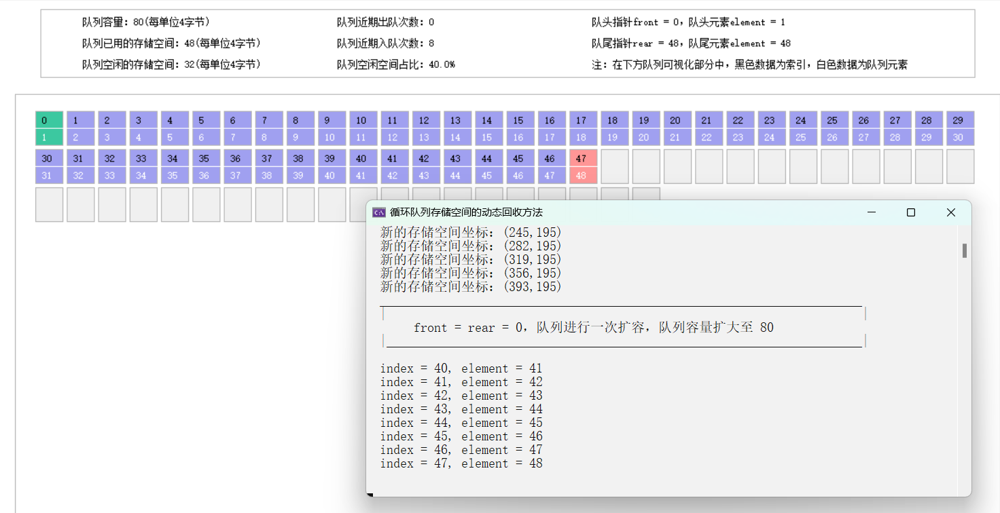

# 循环队列的动态回收及可视化

## 如何运行程序

下载 `EasyX` 安装程序并安装：

[EasyX安装](https://easyx.cn/)

使用 `Microsoft Visual Studio` 创建项目，在项目中创建本项目的源代码。直接运行会出现 `C4996` 报错，点击 `项目` -> `属性` -> `配置属性` -> `C++` -> `预处理器` -> `预处理器定义`，填入以下内容即可解决：

```text
_CRT_NONSTDC_NO_DEPRECATE;_CRT_SECURE_NO_WARNINGS;%(PreprocessorDefinitions)
```

## 程序的逻辑实现

* front < rear


* front >= rear


## 总体设计


## 程序的关键部分

* 收缩队列的时机  
在进行出队时，根据近期出队次数和近期入队次数以及当前空闲空间占比，判断当前是否存在过多空闲空间和队列近期是否有收缩的趋势，如果某次出队操作后监测到当前队列的空闲空间占比过大(例如超过当前存储空间的50%)，且监测到近期出队次数较入队次数多于某个比例(例如2倍、1.5倍)，我们就对队列进行收缩操作，这样就在队列将要进行收缩的初期完成了预判和及时对空闲空间进行回收。

* 队列扩张
  当队满时进行队列扩张，即 front = rear 时。

程序的收缩和扩张都通过函数 resizeQueue() 实现：

```c
/* 将队列收缩或扩张到原先的percent比例的状态 */
void resizeQueue(Queue& Q, double percent) {
    int length = getLength(Q);//队列已用的长度
    int newSize = Q.QueueSize * percent;//队列新的长度
    if (length >= newSize) {
        printf("队列收缩后的空间不足以存储所有数据，无法完成收缩操作！");
        return;
    }
    //按照变换比例 percent 分配收缩或扩张后的队列存储空间
    ElementType* newSpace = (ElementType* )malloc(sizeof(ElementType) * newSize);

    //将队列中的元素复制到新的存储空间，将数据从新空间的起始位置开始存储
    //内存对齐：进行元素复制时，内存拷贝函数 memcpy() 来实现，确保操作高效。
    if (Q.front < Q.rear) //队头在队尾前面
        memcpy(newSpace, &Q.element[Q.front], sizeof(ElementType) * getLength(Q));
    else {//队尾在队头前面的情况
        //第一部分，将队头到队列存储空间末尾位置的数据复制到新的存储空间中
        int len = Q.QueueSize - Q.front;
        memcpy(newSpace, &Q.element[Q.front], sizeof(ElementType) * len);

        //第二部分，从队列存储空间起始位置到队尾的数据复制到新的存储空间中
        memcpy(newSpace + len, Q.element, sizeof(ElementType) * Q.rear);
 }

    // 释放原队列空间
    free(Q.element);

    // 更新队列的存储空间和头部指针
    Q.element = newSpace;
    Q.QueueSize = newSize;
    Q.front = 0; // 将队头指针设置为0
    Q.rear = length; //队尾指针设置为队列长度

    enQueueTimes = 0;//将近期入队次数清零
    deQueueTimes = 0;//将近期出队次数清零
}
```

## 程序使用





## 备注

* 本程序使用 Microsoft visual studio 开发，需要额外引入图形库 EasyX
* 程序中通过图形库 EasyX 实现队列的可视化及动画
* 程序的队列信息和数据展示通过图像库 EasyX 的 drawtext() 实现，弹出输入框也是利用该图形库中的 InputBox() 实现。
* 队列存储空间用 EasyX 的 fillrectangle() 实现绘制。
